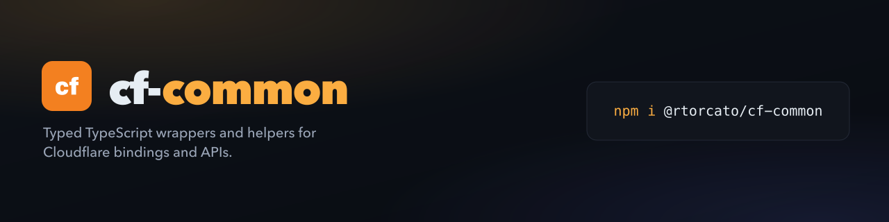

<!-- brand-kit:banner:start -->
<picture>
  <source media="(max-width: 640px)" srcset="./brand/banner-mobile.png">
  
</picture>
<!-- brand-kit:banner:end -->

# cf-common

[](https://www.npmjs.com/package/@rtorcato/cf-common)
[](https://docs.torcato.dev/cf-common/)
[](./LICENSE)

Typed TypeScript wrappers and helpers for working with Cloudflare bindings and
APIs — in the spirit of [`js-common`](https://docs.torcato.dev/js-common/) and
[`browser-common`](https://docs.torcato.dev/browser-common/).

Each module is a **thin, well-typed convenience layer** over a Cloudflare
service — not a framework. Tree-shakeable subpath exports, zero required runtime
dependencies, built for the Workers (workerd) runtime.

## Install

```sh
pnpm add @rtorcato/cf-common
```

**Requirements:** a Cloudflare Workers project (Wrangler). TypeScript ≥ 5.0 is
recommended — every public API ships with strict types and JSDoc.

## Quick start

```ts
import { getBinding, requireEnv } from '@rtorcato/cf-common/env'
import { createKvStore } from '@rtorcato/cf-common/kv'
import { toCloudflareError } from '@rtorcato/cf-common/errors'

interface User {
  id: number
  name: string
}

export default {
  async fetch(req: Request, env: Record<string, unknown>): Promise<Response> {
    try {
      // Throws a 500 if the binding is missing — a deploy misconfiguration,
      // not a client error.
      const users = createKvStore<User>(getBinding(env, 'USERS'))

      const user = await users.get('u:42') // User | null, JSON-parsed
      if (!user) return Response.json({ error: 'Not found' }, { status: 404 })

      return Response.json(user)
    } catch (err) {
      const e = toCloudflareError(err)
      return Response.json(
        { error: e.expose ? e.message : 'Internal error', code: e.code },
        { status: e.status }
      )
    }
  },
}
```

## Modules

Each module is a separate subpath import, so you ship only what you use.

| Subpath | Description | Status |
| --- | --- | --- |
| [`@rtorcato/cf-common/errors`](https://docs.torcato.dev/cf-common/docs/api/errors) | `CloudflareError` (HTTP `status` + `expose` + `code`), `isCloudflareError`, `toCloudflareError` | ✅ Shipped |
| [`@rtorcato/cf-common/env`](https://docs.torcato.dev/cf-common/docs/api/env) | `getBinding`, `requireEnv`, `getEnv` — typed access to Worker bindings and vars | ✅ Shipped |
| [`@rtorcato/cf-common/kv`](https://docs.torcato.dev/cf-common/docs/api/kv) | `createKvStore` — typed JSON get/put/delete/list with TTL + metadata | ✅ Shipped |
| `@rtorcato/cf-common/ratelimit` | `rateLimit` — typed Rate Limiting binding wrapper with IP / identifier keys | ✅ Shipped |
| [`@rtorcato/cf-common/r2`](https://docs.torcato.dev/cf-common/docs/api/r2) | `createR2Store` + `multipartUpload` — object helpers and a multipart driver | ✅ Shipped |
| [`@rtorcato/cf-common/d1`](https://docs.torcato.dev/cf-common/docs/api/d1) | `query`/`queryFirst`/`execute`/`batch` + idempotent `runMigrations` | ✅ Shipped |

More land incrementally (HTTP, Request, Queues, Durable Objects, Cache, Workers
AI, …). See the [milestones](https://github.com/rtorcato/cf-common/milestones)
for the roadmap, or the
[Beta milestone](https://github.com/rtorcato/cf-common/milestone/1) for what's next.

## Agent skill

This repo ships an agent skill (`skills/cf-common/SKILL.md`) that teaches coding
agents the subpath imports, the `CloudflareError` / `defineFetch` error contract,
and each module's API. Install it in one command, straight from GitHub:

```sh
npx skills add https://github.com/rtorcato/cf-common --skill cf-common
```

## Documentation

Full docs and the per-module API reference live at
**[docs.torcato.dev/cf-common](https://docs.torcato.dev/cf-common/)**.

## Development

```sh
pnpm install
pnpm verify        # typecheck + biome + tests
pnpm build         # tsup → dist/ (ESM, per-module subpaths)
pnpm test:watch    # vitest in watch mode
```

Commits follow [Conventional Commits](https://conventionalcommits.org/);
releases are cut by semantic-release when the `release.yml` workflow is
dispatched.

## License

[MIT](./LICENSE) © Richard Torcato
